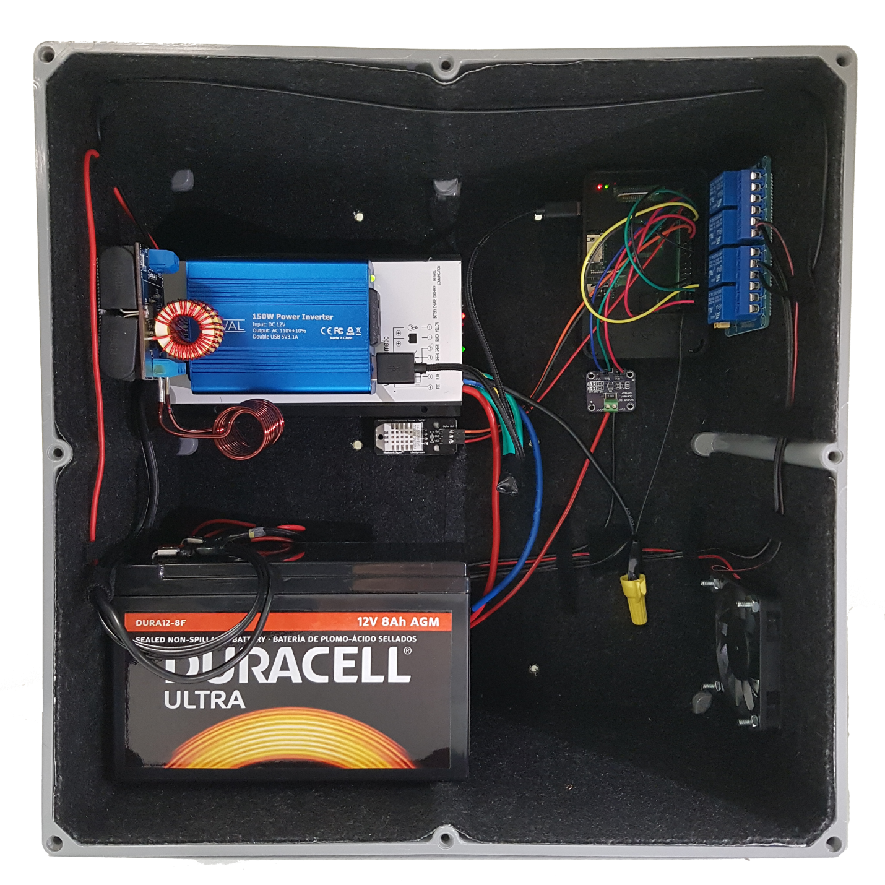

# Battery-24-7

## Objective
This project is proposed the battery to be suvived in the extreme weather. Especially, we consider the WaggleStack which can be placed in power-free condition such as forest, mountain, glacier, and so on. To support electric, we thought the battery is appropriate. However, the battery has temperature range to operate. For example, It cannot operate in low temperature. Our project is designing the battery control system to endure the extreme weather.

## Contents
* [control_system](./ctrl_sys)
* [server](./server)
* [app](./app) for android

## Hardware Design

## Collaborators
* [LamFSangUk](https://www.github.com/LamFSangUk) - **SangUk Park** \<psu9808@gmail.com\> Android/Web Server 
* [NableKim](https://www.github.com/NableKim) - **SeungSoo Kim** \<nablekim94@gmail.com\> Android/Web Server     
* [Ryunhwan](https://www.github.com/Ryunhwan) - **RyunHwan Kwon** \<krh322@gmail.com\> Control System/Battery Box Circuit Design
* [gommuluk](https://www.github.com/gommuluk) - **HyoMin Nam** \<skagbghk@gmail.com\> Database/Web Server/Data Backup/Paper
* [eunsuh](https://www.github.com/eunsuh) - **EunSuh Lee** \<eunsuh1231@gmail.com\> Control System/Paper
* [gudrjs012](https://www.github.com/gudrjs012) - **HyeongGun Lee** \<gudrjs012@gmail.com\> Database/Python Director/Paper
* [jun-hu](https://www.github.com/jun-hu) - **JunHu Kang** \<steve.jh.kang@gmail.com\> Control System/Paper
*  - **YoungJi Lee** \<yjgk21c@naver.com\>
*  - **WonKeun Cho** \<dasoll@naver.com\>
*  - **WuMel Lee** \<milkcaramel66@gmail.com\>
