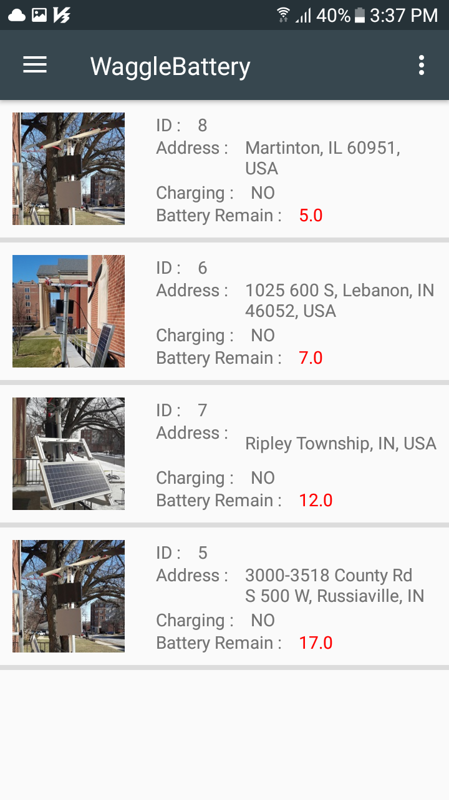
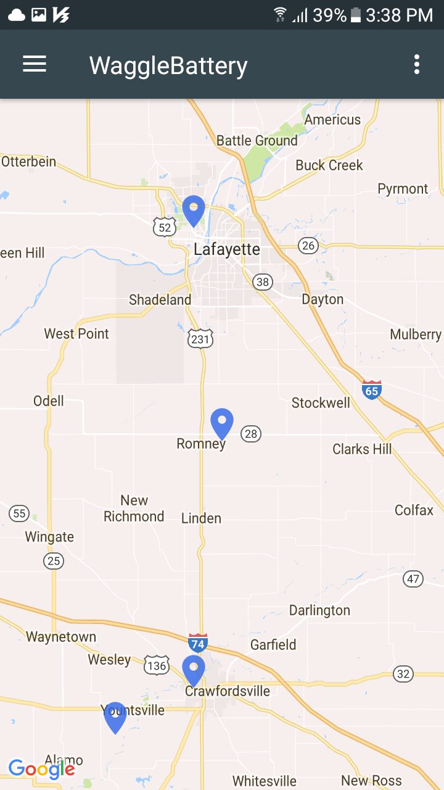
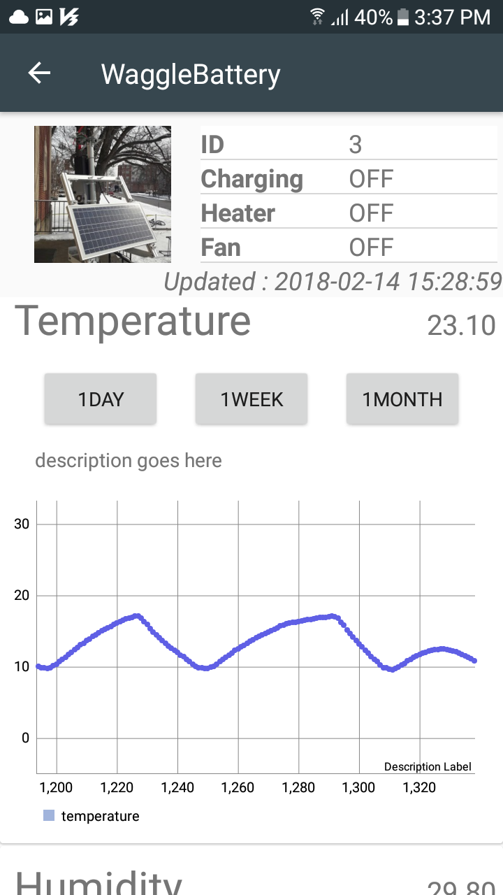

Android Application
===================

We developed the android application to monitor the status of battery boxes. The application supports to show the list of operating battery boxes and the position where the battery boxes are placed using Google Map. Moreover, the application alerts the low battery status to administartor to manage. We used the data charts to describe situation of each battery box. It makes easier to control the battery boxes.

 
</img>
</img>
</img>
 

Contents
--------
* [src](./WaggleBattery/app/src/main/java/waggle)
* [xml](./WaggleBattery/app/src/main/res/layout)
* drawable

 

Download
--------

